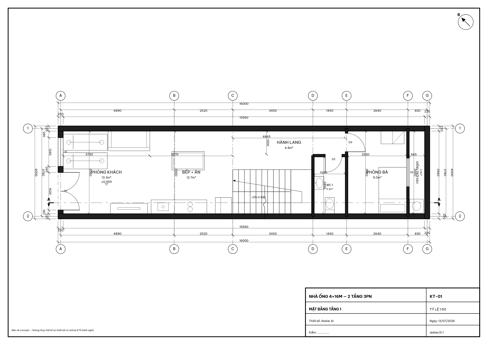
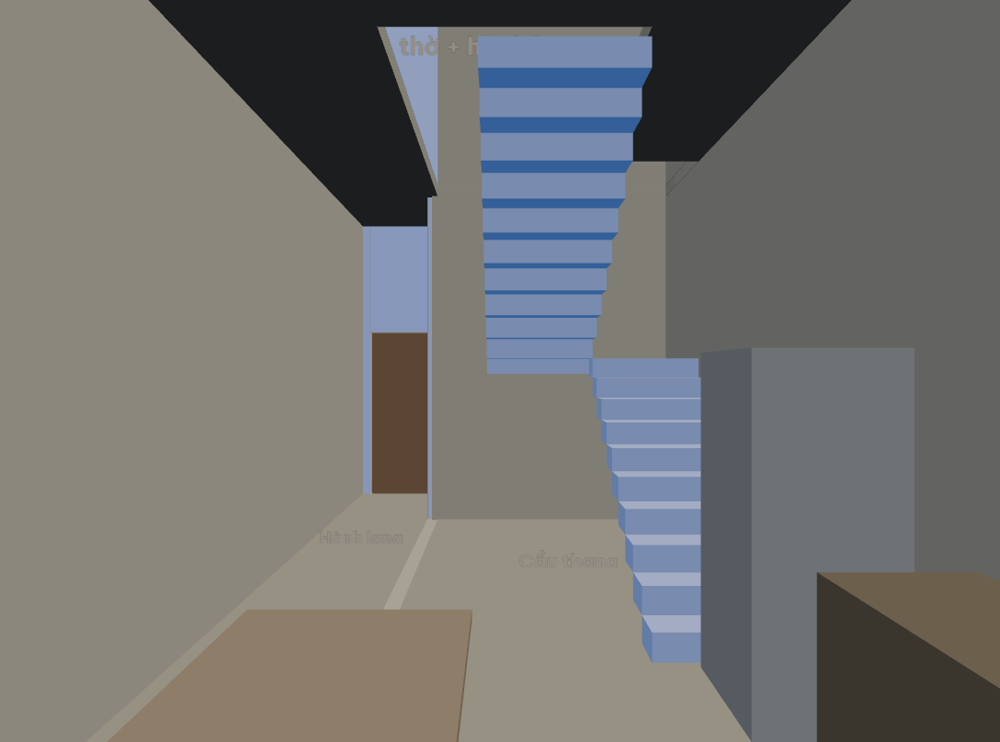
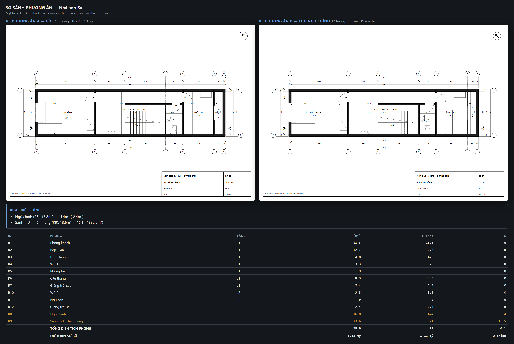

🇬🇧 [English](README.md) · **Tiếng Việt**

# Atelier 📐

**Kiến trúc sư AI trong Claude Code** — từ mô tả bằng lời đến bản vẽ nhà đúng chuẩn ký hiệu và mô hình 3D có nội thất, với bản live trên trình duyệt cho phép chỉnh sửa trực tiếp bằng tay.

> **Atelier** /a-tơ-li-ê/ — "xưởng thiết kế". Tên chốt ngày 13/07/2026 (tên làm việc cũ: Thợ Cả).

| Mặt bằng chuẩn ký hiệu + dim 3 chuỗi | Đi bộ trong nhà (WASD) | So sánh phương án A/B |
|---|---|---|
|  |  |  |

## Ý tưởng cốt lõi

**Một model tham số (JSON) là nguồn sự thật duy nhất.** Claude sửa model qua MCP tools; con người sửa trực tiếp trên web editor (kéo thả, gõ số); hai bên đồng bộ realtime qua WebSocket. Renderer deterministic sinh ra bản vẽ 2D đúng ký hiệu và mô hình 3D nội thất từ cùng một nguồn — nên 2D và 3D không bao giờ lệch nhau, và ký hiệu luôn chuẩn vì không do AI vẽ.

```
Claude Code ──MCP──► Server (model + validator + renderer) ◄──WebSocket──► Trình duyệt (live editor)
```

## Cài đặt (30 giây)

Không cần clone gì cả — Atelier phát hành dạng gói npm ([`atelier-mcp`](https://www.npmjs.com/package/atelier-mcp)). Đứng trong thư mục dự án nhà CỦA BẠN và đăng ký:

```bash
mkdir nha-cua-toi && cd nha-cua-toi          # một thư mục = một căn nhà
claude mcp add atelier -- npx -y atelier-mcp
claude                                       # rồi nói: "thiết kế cho tôi nhà ống 4×16m"
npx playwright install chromium              # tùy chọn, một lần — xuất PNG/PDF
```

Claude Desktop (hoặc MCP client bất kỳ) — cùng lệnh đó, vd trong `claude_desktop_config.json`:

```json
{ "mcpServers": { "atelier": {
    "command": "npx", "args": ["-y", "atelier-mcp"],
    "env": { "ATELIER_DIR": "C:\\duong-dan\\nha-cua-toi" } } } }
```

Bảng đơn giá địa phương: đặt `rules/don-gia.json` trong thư mục nhà để đè bảng đóng gói.

## Chạy từ source (người đóng góp)

```bash
pnpm install
npx playwright install chromium   # render PNG/PDF + demo
pnpm build:web
pnpm demo:p5                      # demo 60 giây: dựng live → kéo tường gõ 4200 → đi bộ 3D
```

Repo đã có sẵn `.mcp.json` — mở Claude Code tại thư mục này là server `atelier` chạy từ source. `pnpm build:cli` build gói npm (`packages/cli`, bundle một file + web editor + font; kiểm bằng `npx tsx packages/cli/smoke.mts <đường-dẫn-gói-đã-cài>`).

## Trạng thái

✅ **Giai đoạn 1 — Engine + bản vẽ tĩnh: hoàn thành 13/07/2026** (71 tests xanh).
Từ fixture nhà ống 4×16m: validator 22 rules (số liệu đối chiếu **TCVN 13967:2024**), renderer mặt bằng SVG/PNG đúng ký hiệu + dim 3 chuỗi, MCP server 7 tools, skill `thiet-ke-nha`, demo trọn nhịp *phỏng vấn → brief → model → ảnh trong chat* (`packages/server/scripts/demo-p1.ts`).
✅ **Giai đoạn 2 — Live một chiều: hoàn thành 13/07/2026.**
`editor_open` mở web editor (Vite + Three.js) cùng process với MCP; mỗi `apply_ops` mọc NGAY trên màn hình — 2D là SVG do server render (ký hiệu chuẩn tuyệt đối), 3D maquette orbit (tường tách mảnh quanh cửa, chưa CSG) — kèm toast + flash 1.5s; `capture_view` trả về đúng khung người dùng đang thấy, fallback mặt bằng server khi chưa mở browser. Demo: `pnpm demo:p2`. Build editor: `pnpm build:web`.
✅ **Giai đoạn 3 — Chỉnh sửa tay: hoàn thành 13/07/2026.**
Chọn/kéo tường-cửa-nội thất ngay trên mặt bằng (tường neo khoảng cách tới tường song song gần nhất, cửa hiện khoảng cách hai đầu, nội thất hít mặt tường); **HUD gõ số** cạnh con trỏ — đang kéo gõ `4200 ⏎` là chốt đúng 4200mm; snap lưới đổi được; undo/redo per-origin (Ctrl+Z/Y — chỉ hoàn tác thao tác của mình); soft-lock "người dùng luôn thắng" (`LOCK-01`, khóa nguội 5s); panel thuộc tính thành ô nhập; `get_changes_since` tóm tắt cũ → mới cho Claude bắt kịp. Demo vòng lặp cộng tác người ↔ Claude: `pnpm demo:p3`.
✅ **Giai đoạn 4 — Hồ sơ bản vẽ: hoàn thành 13/07/2026.**
Bộ hồ sơ concept trọn vẹn đánh số KT-01…: mặt bằng từng tầng (thêm dim thông thủy trong phòng + vết cắt A-A), **mặt đứng chính**, **mặt cắt A-A qua thang** (poché, lỗ cửa, profile bậc, chiếu nghỉ), **bảng thống kê phòng & cửa**; xuất **PDF A3 một file nhiều trang**, **DXF** (TS thuần, mm thật — mở CAD đo được) và SVG. Tools mới: `export`, `render_view`. Demo: `pnpm demo:p4`.
✅ **Giai đoạn 5 — Nội thất & trải nghiệm: hoàn thành 13/07/2026.**
**Demo 60 giây chạy trọn** (`pnpm demo:p5`): dựng live → kéo tường gõ `4200` → Claude thích nghi → **đi bộ WASD** xuyên nhà có nội thất → **sun study** theo giờ/tháng. Catalog **106 asset** chuẩn hóa mm thật (hình học tham số CC0 tự sinh + license manifest; glTF photoreal để dành P5+), 3D nội thất dựng theo category, sàn tô theo vật liệu hoàn thiện; editor có panel catalog (tool 5, click đặt, R xoay); MCP thêm `assets_search` trả contact-sheet.

**Lộ trình 6 giai đoạn P0–P5 đã hoàn thành.**
✅ **Backlog — Dự toán sơ bộ (13/07/2026):** tool `estimate_cost` + tờ **DỰ TOÁN SƠ BỘ** (KT-06) trong bộ PDF — diện tích quy đổi (móng/sàn/mái) × bảng đơn giá `rules/don-gia.json` (người dùng sửa theo địa phương), tự đối chiếu ngân sách trong brief.
✅ **Backlog — Link chia sẻ chỉ-xem (13/07/2026):** nút **chia sẻ** trên editor (hoặc lấy từ `editor_open`) → `/xem/<token>` gửi người thân cùng ngắm: thấy live, đi bộ, xem nắng — nhưng server cưỡng chế không sửa được (`VIEW-01`). Thu hồi: `POST /share/rotate`. Mở cho máy khác trong LAN: `ATELIER_HOST=0.0.0.0`.
✅ **Backlog — So sánh phương án A/B (13/07/2026):** `variant_save` chụp bố trí hiện tại thành phương án có tên; `variant_compare` đặt 2 mặt bằng cạnh nhau + diff diện tích từng phòng **+ dự toán từng bên**; `variant_open` quay lại phương án cũ; trang `/so-sanh` xem trên trình duyệt.
✅ **Song ngữ (13/07/2026):** docs dịch đủ 11 tài liệu (`docs/en/`); **UI editor song ngữ tự nhận theo quốc gia** — ở Việt Nam ra tiếng Việt, ngoài Việt Nam ra tiếng Anh (múi giờ + ngôn ngữ trình duyệt, không geo-IP); nút **VI/EN** chọn tay luôn thắng (cả tên 106 asset). Bản vẽ xuất ra giữ tiếng Việt (chủ đích — hồ sơ TCVN).
✅ **Backlog — Rule pack quy hoạch (13/07/2026):** pack `pln.json` 6 rules (lùi trước/sau mọi hình lô, mật độ xây dựng, số tầng, chiều cao, ô văng vươn hẻm) chạy từ `brief.quy_hoach` — khai gì kiểm nấy, không khai không phạt.
✅ **Backlog — IFC + đường photoreal (13/07/2026):** `export ifc` — writer IFC4 thuần TS mức concept (tường + lỗ cửa đúng quan hệ voids/fills, sàn có lỗ thật, thang, phòng thành IfcSpace, GlobalId deterministic) mở được trong BIM viewer, KHÔNG thay hồ sơ thi công; `export gltf` — MỘT file GLB mét thật (mỗi entity một node theo id) + `scripts/render-photoreal.py` render Cycles bằng Blender headless, nắng đúng giờ/tháng như sun study.
✅ **Backlog — Import DXF/ảnh mặt bằng cũ (14/07/2026):** `underlay_import` đặt bản CAD cũ (DXF) hoặc ảnh chụp/scan mặt bằng làm **nền mờ đồ lại** dưới mặt bằng live — tỷ lệ tự suy từ đơn vị DXF hoặc căn bằng 2 điểm + một khoảng cách thật; `underlay_trace` dò cặp nét song song thành **ứng viên tường** (đề xuất, duyệt tay rồi mới áp). Nền chỉ là giàn giáo: không bao giờ vào bộ hồ sơ xuất.
Ngoài phạm vi theo thiết kế (Q3): kết cấu/MEP — đây là công cụ concept, không thay hồ sơ thi công.

## Bộ tài liệu

Bản dịch tiếng Anh đầy đủ ở [`docs/en/`](docs/en/) — mỗi file link chéo; khi hai bản lệch nhau, **bản tiếng Việt là chuẩn**.

| # | Tài liệu | Nội dung |
|---|---|---|
| 01 | [Tầm nhìn & định vị](docs/01-tam-nhin.md) | Người dùng, non-goals, cạnh tranh, điểm khác biệt |
| 02 | [Quy trình thiết kế](docs/02-quy-trinh-thiet-ke.md) | Phỏng vấn → brief → 5 pha có checkpoint duyệt |
| 03 | [Kiến trúc hệ thống](docs/03-kien-truc-he-thong.md) | Dual-client, một process, luồng dữ liệu |
| 04 | [Schema dữ liệu](docs/04-schema-du-lieu.md) | Model tham số: tường, cửa, phòng, thang, nội thất |
| 05 | [MCP tools](docs/05-mcp-tools.md) | ~19 tools + bộ từ vựng ops |
| 06 | [Giao thức sync](docs/06-giao-thuc-sync.md) | WebSocket, revision, xung đột, undo |
| 07 | [Validator & rules](docs/07-validator-rules.md) | Bộ rule TCVN + hình học + thước Lỗ Ban |
| 08 | [Renderer 2D](docs/08-renderer-2d.md) | Layer, nét, ký hiệu, dim, khung tên, SVG/PDF |
| 09 | [Web editor](docs/09-web-editor.md) | UX chỉnh sửa tay: kéo thả, gõ số, 3D, walkthrough |
| 10 | [Lộ trình](docs/10-lo-trinh.md) | 6 giai đoạn với Definition of Done + backlog |
| 11 | [Quyết định & câu hỏi mở](docs/11-quyet-dinh-mo.md) | 10 ADR + 8 câu hỏi đã chốt |

## Stack

TypeScript monorepo — Node.js (MCP server + WebSocket), Three.js (3D), SVG (bản vẽ 2D), Vite (web editor), Vitest + Playwright (test). Chi tiết và lý do: `03-kien-truc-he-thong.md`.

## Môi trường dev

Repo đã tích hợp **[haido](https://github.com/lebac-svg/haido)** (v0.2.3) — memory layer neo vào code, làm bộ nhớ dự án cho chính quá trình phát triển Atelier:

- `.mcp.json` → MCP server `haido serve` (tools: recall / remember / related / overview / stale / reanchor)
- `.claude/settings.json` → hooks tự nạp tri thức vào phiên Claude Code (SessionStart / PostToolUse / Stop)
- DB local ở `.haido/` (đã gitignore); tri thức chia sẻ qua **memory pack** `docs/memory-pack/` (commit được)
- Mở Claude Code tại thư mục repo này (restart nếu đang mở) và chấp thuận MCP server ở lần đầu

## Giấy phép & miễn trừ

- **Code:** [MIT](LICENSE). **Font** Be Vietnam Pro: SIL OFL 1.1 (`OFL.txt` cạnh file font). **Catalog nội thất** tham số: CC0-1.0 (`packages/core/assets/license-manifest.json`).
- Số liệu tiêu chuẩn trong `rules/*.json` trích dẫn TCVN/QCVN kèm nguồn từng rule; bảng đơn giá `rules/don-gia.json` là số **tham khảo** — sửa theo địa phương của bạn.
- ⚠ **Bản vẽ Atelier sinh ra là bản concept** — dùng để suy nghĩ, trao đổi và làm việc với kiến trúc sư; **không thay thế hồ sơ thiết kế/xin phép có chữ ký KTS hành nghề**.

## 5 nguyên tắc bất di bất dịch

1. **Claude không bao giờ vẽ trực tiếp** — chỉ sửa model tham số; renderer mới là thứ vẽ.
2. **Ký hiệu chuẩn nằm trong renderer** — encode một lần theo TCVN, đúng 100% mọi lúc.
3. **Mọi mutation đi qua một cổng duy nhất** (`apply_ops`) — transaction, validate, broadcast.
4. **Người dùng luôn thắng** — chỉnh sửa tay không bao giờ bị Claude ghi đè.
5. **Claude phải tự nhìn trước khi mời người dùng xem** — validate + render + capture sau mỗi thay đổi lớn.
